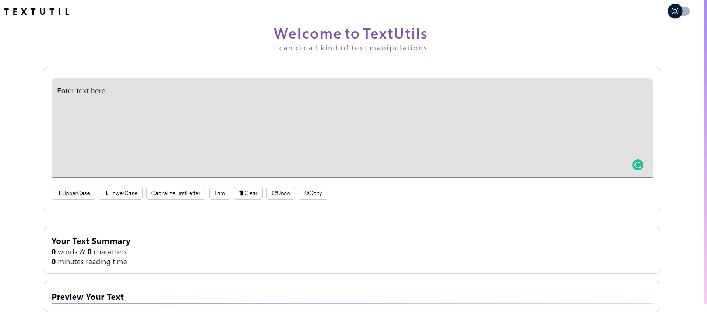
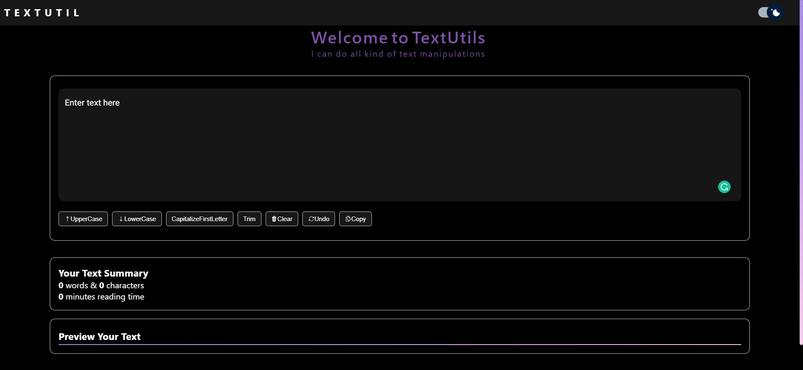
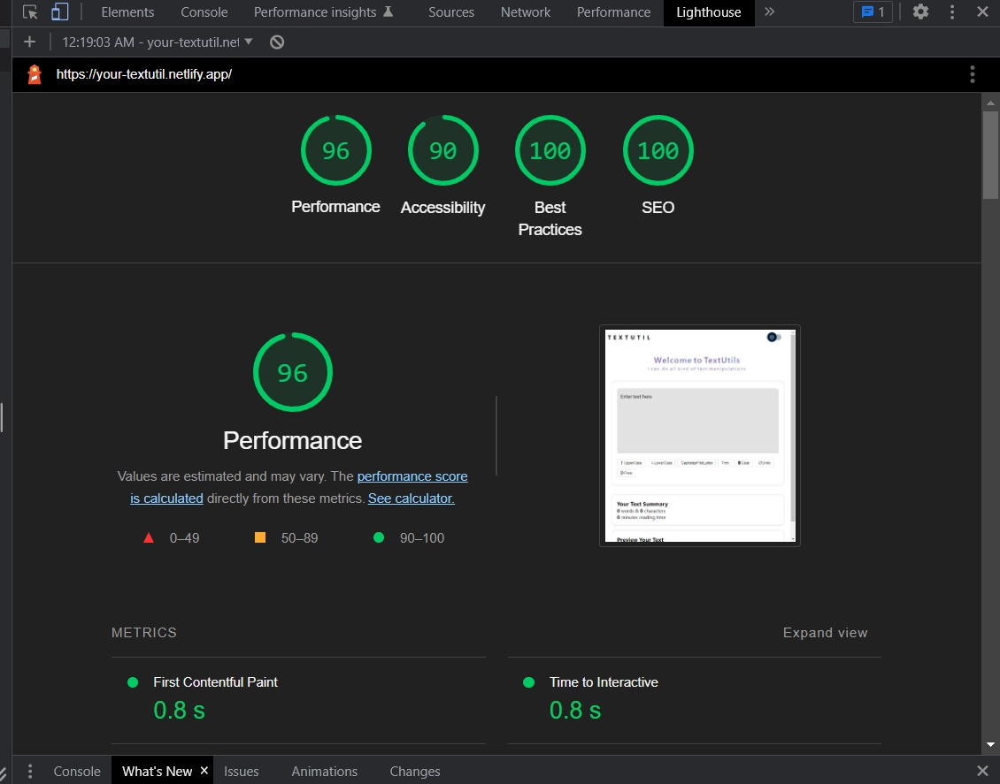

## Text-Util
A web application that allows you to manipulate text in various ways.

## Contributors
- [Partha](https://github.com/partha7978/text-utils)

## screenshot

## Lighthouse Score

## Functionality
- [x] Uppercase
- [x] Lowercase
- [x] Capitalize first letter
- [x] Remove extra spaces
- [x] Clear text
- [x] Undo text
- [x] Copy text

## Tech used
- Html
- Css
- Javascript
- React
- React-State
- MUI
- Ionion
- Heroicons
- Framer-motion

## Contributing
Contributions are welcome. Please open an issue or a pull request on [GitHub](https://github.com/partha7978/text-utils)

Copyright (c) 2022 <a href="https://parthasarathimuduli.netlify.app/" target="_self">Partha Sarathi Muduli</a>